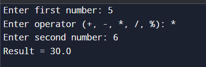

# Java Calculator App

This is a simple calculator application built using **Java**.
It performs basic arithmetic operations based on user input through the terminal.

---

## Features

* Addition (+)
* Subtraction (-)
* Multiplication (*)
* Division (/)
* Modulus (%)
* Handles division by zero
* User-friendly input via terminal

---

## Technologies Used

* Java
* Scanner Class (User Input)
* Basic Concepts: Conditions, Switch Case

---

## Project Structure

```
calculator-project/
│── Calculator.java
│── README.md
```

---

## How to Run

1. Install Java (JDK) if not already installed
2. Open terminal in project folder
3. Compile the program:

```
javac Calculator.java
```

4. Run the program:

```
java Calculator
```

---

## Output Screenshot



```bash
java calculator.java

